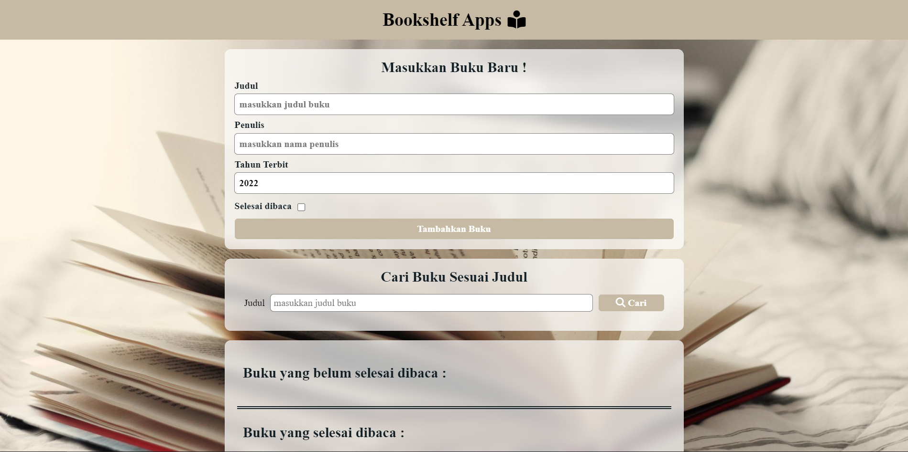

# Bookshelf-Apps 📚

  

Ini merupakan aplikasi pengelolaan data `Bookshelf-Apps` menggunakan DOM dan Web Storage.

## Fitur
- Menambahkan buku baru.
- Menandai buku sebagai buku selesai dibaca atau belum selesai dibaca.
- Menghapus buku dari daftar.
- Menampilkan daftar buku yang tersimpan.
- Memindahkan buku antar rak.
- Melakukan pencarian buku berdasarkan judul.
- Menghapus semua data buku

## Teknologi
- HTML
- CSS
- JavaScript

## Link
- [Iful Rahman Bookshelf App](https://ifulrahman.github.io/ifulrahmanBookShelfApp.github.io/)
